# Automating Deployment of Cosmosdb with Nodejs using Azure DevOps Pipelines

## Before you begin

1. Ensure have Azure subscription and Azure DevOps organization setup
2. Clone this Azure DevOps reposistory to have source code and create project for this Lab
3. Create Service principal which you will use to create Azure services

## Instructions for Automating Deployments using Azure Pipeline
1. We have Project code and Reposistory setup
2. Create Azure Pipeline to Build NodeJs Express code and package configuration as Artifact
3. Create Release Pipelines to Create Azure services such as Website, Cosmosdb and deploy code artifact
4. Enable Build Pipeline to start with trigger for change on code in Reposisotry
5. Enable Continous Deployment trigger for New release to be created everytime new code is built 

### Steps for Build Pipeline to Package NodeJs Express Code

Follow step by step instructions as shown in Screenshot below

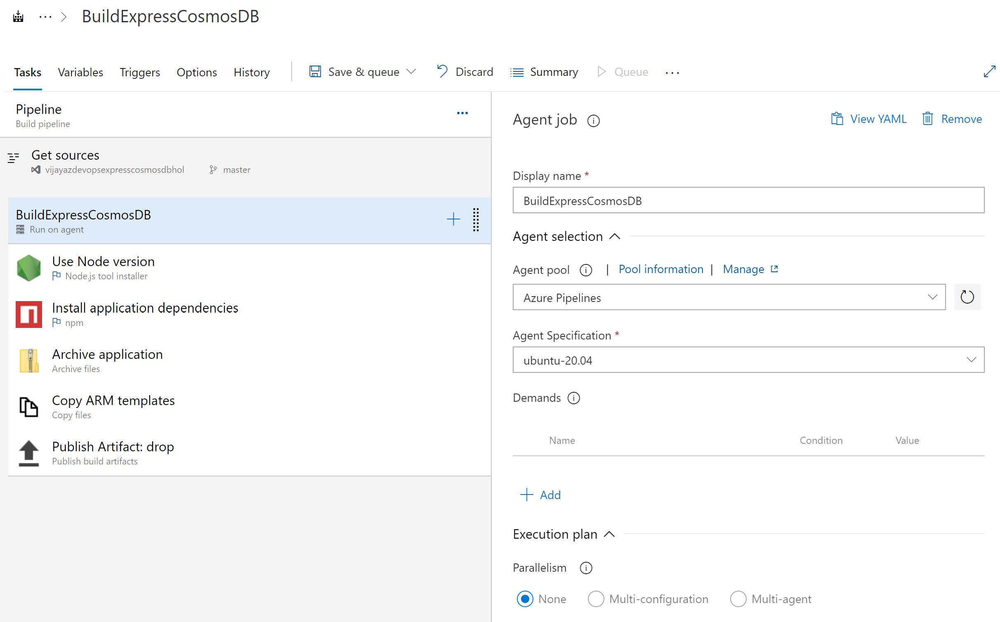

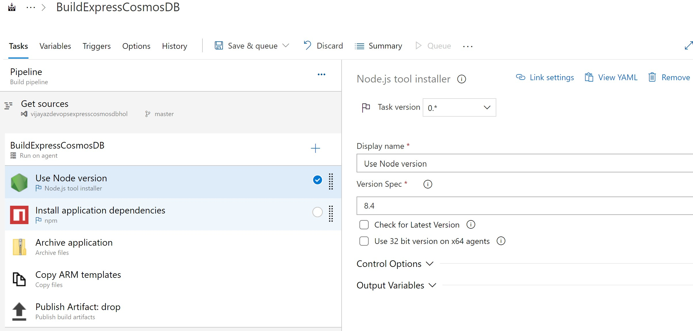

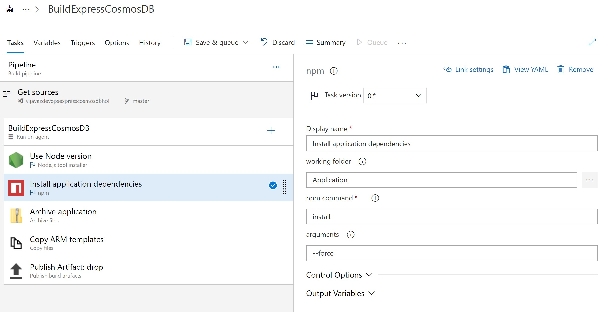

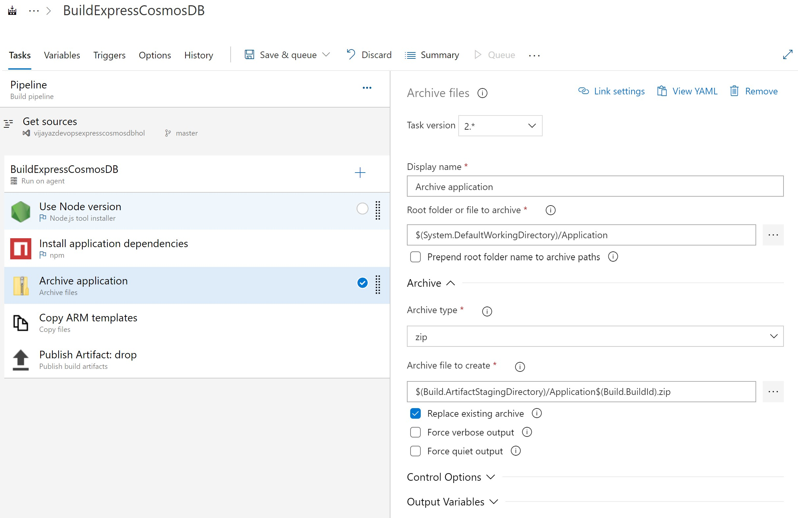

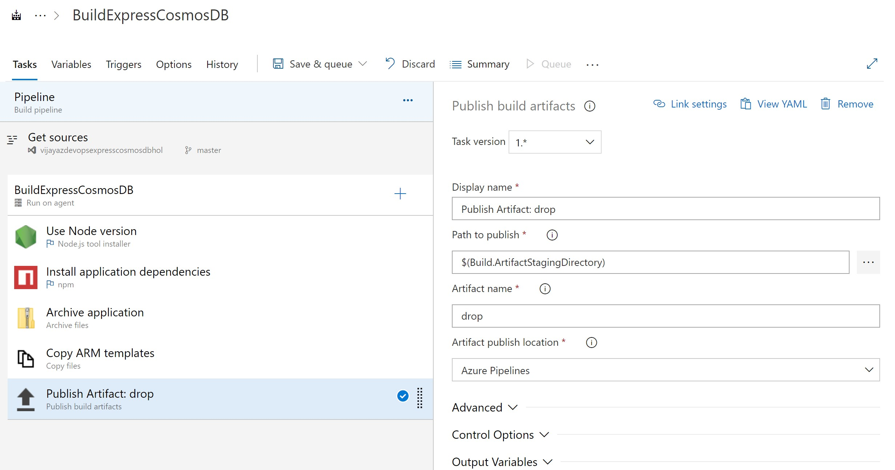

### Step for Release pipeline to Create Azure Services and Deploy code

Create New Release pipeline and add Artifact drop from Build Pipeline

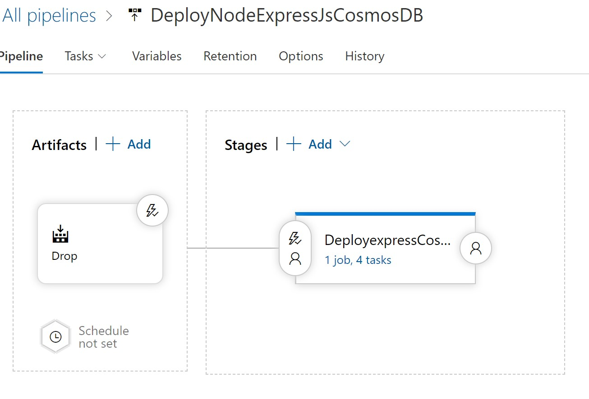

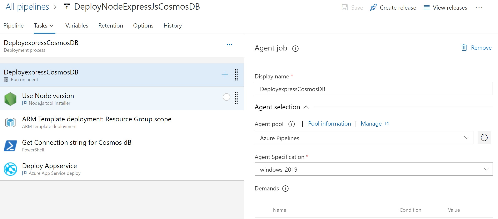

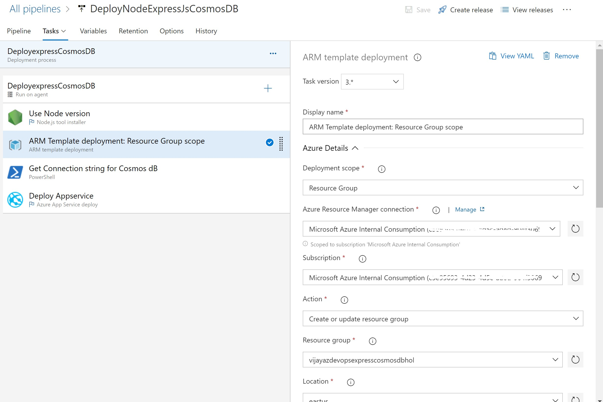

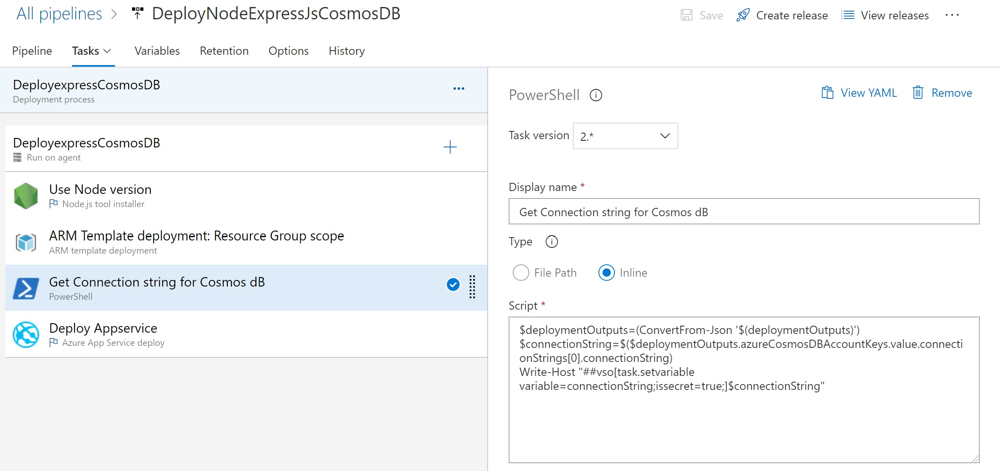

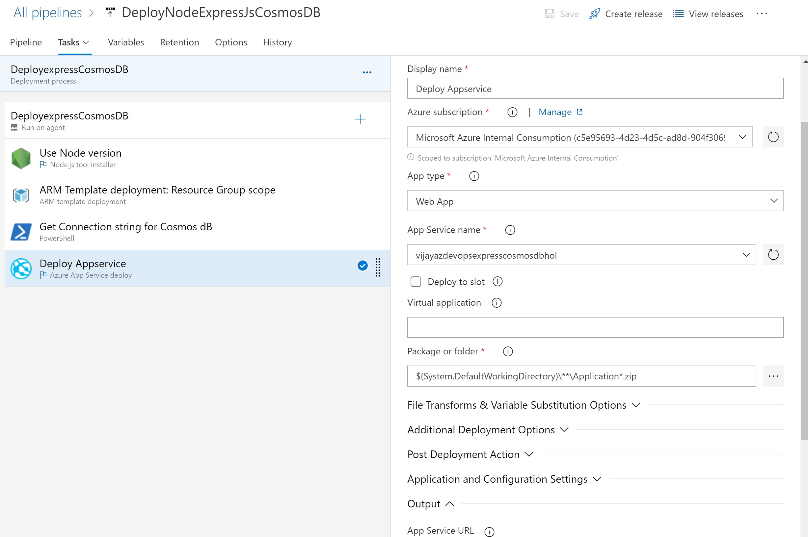

### Finaly browse your website <WebsiteName>

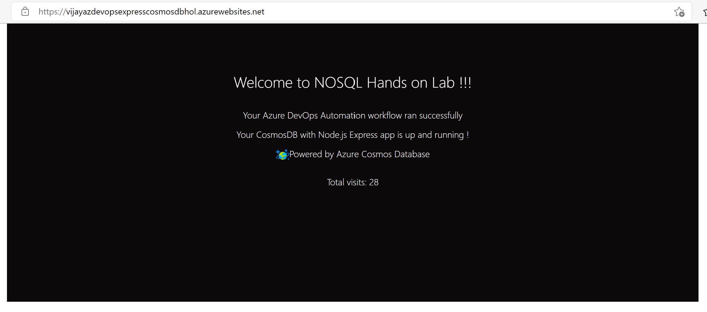

 
# Summary
**In this Lab using Azure Pipeline as Automation workflow we implemented**

**1. Azure Services for Webapp and Cosmosdb Database**

**2. Build ExpressJs Code and package saved as Artifact**

**3. Created Azure Services in Release pipelines and updated code using Automation workflow**
