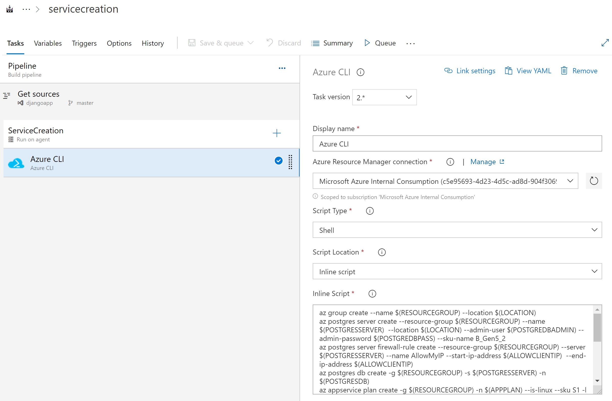
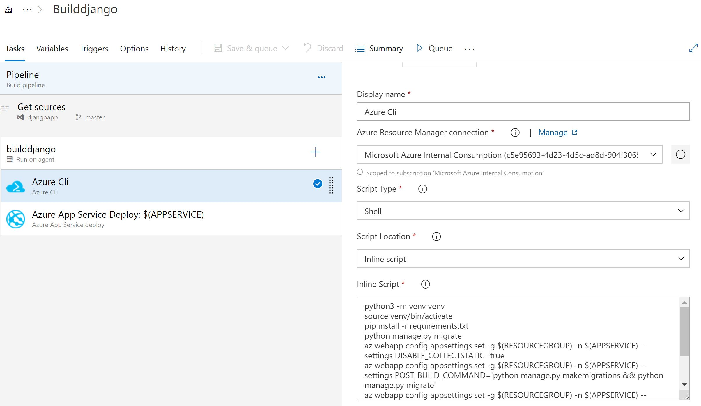
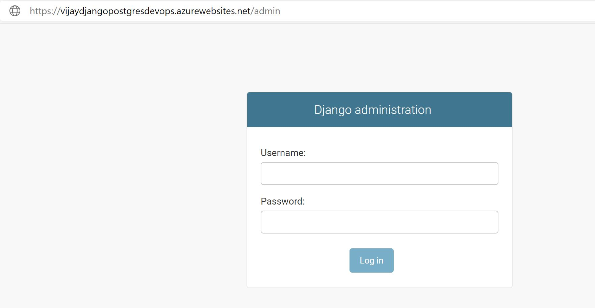
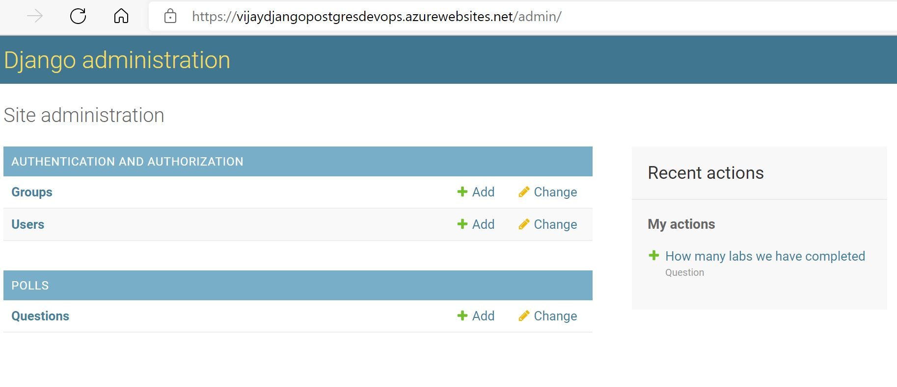
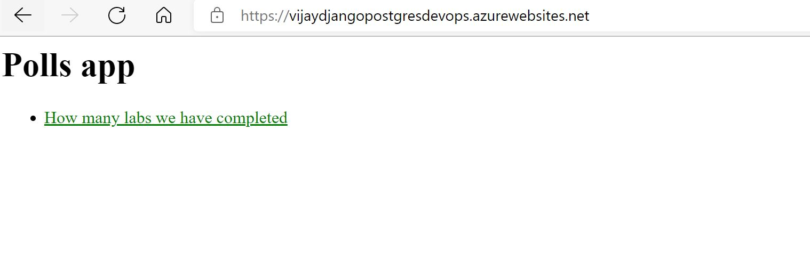
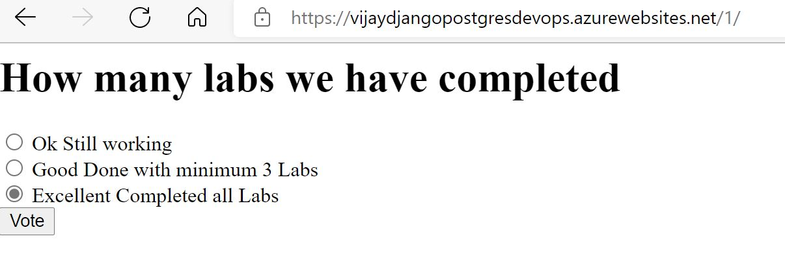

# Automating Deployment of Polls App using Django Framework and PostgresDB

## Before you begin

1. Ensure have Azure subscription and Azure DevOps organization setup
2. Create Azure DevOps project for this Lab and clone this reposistory for source code
3. Create Service principal which you will use to create Azure services

## Instructions for Automating Deployments using Azure Pipeline
1. We have Project code and Reposistory setup
2. create Azure Pipleline to setup Azure services at first place
3. Create Azure Pipeline to Build Python code and publish that to Appservice
4. Work on updating Database as code by Create Polls Questions using pSql Scripts

### Task 1 : Create First Pipeline for Azure Webapp and PostresDB Service Creation

#### Azure CLI commands for Azure CLI task

    az group create --name $(RESOURCEGROUP) --location $(LOCATION)
    az postgres server create --resource-group $(RESOURCEGROUP) --name $(POSTGRESSERVER)  --location $(LOCATION) --admin-user $(POSTGREDBADMIN) --admin-password $(POSTGREDBPASS) --sku-name B_Gen5_2
    az postgres server firewall-rule create --resource-group $(RESOURCEGROUP) --server $(POSTGRESSERVER) --name AllowMyIP --start-ip-address $(ALLOWCLIENTIP)  --end-ip-address $(ALLOWCLIENTIP)
    az postgres db create -g $(RESOURCEGROUP) -s $(POSTGRESSERVER) -n $(POSTGRESDB) 
    az appservice plan create -g $(RESOURCEGROUP) -n $(APPPLAN) --is-linux --sku S1 -l $(LOCATION)
    az webapp create -g $(RESOURCEGROUP) --plan $(APPPLAN) --name $(APPSERVICE) --runtime "PYTHON|3.8"
    az webapp config appsettings set -g $(RESOURCEGROUP) -n $(APPSERVICE) --settings DBNAME=$(POSTGRESDB)
    az webapp config appsettings set -g $(RESOURCEGROUP) -n $(APPSERVICE) --settings DBUSER=$(POSTGREDBADMIN)
    az webapp config appsettings set -g $(RESOURCEGROUP) -n $(APPSERVICE) --settings DBPASS=$(POSTGREDBPASS)
    az webapp config appsettings set -g $(RESOURCEGROUP) -n $(APPSERVICE) --settings DBHOST=$(POSTGRESSERVER)
    az webapp config appsettings set -g $(RESOURCEGROUP) -n $(APPSERVICE) --settings DBPORT=5432

### Task 2 : Create Second Pipeline to Build Python Code for Django and publish to Webapp

#### Azure CLI commands for Azure CLI task

    python3 -m venv venv
    source venv/bin/activate
    pip install -r requirements.txt
    python manage.py migrate
    az webapp config appsettings set -g $(RESOURCEGROUP) -n $(APPSERVICE) --settings DISABLE_COLLECTSTATIC=true
    az webapp config appsettings set -g $(RESOURCEGROUP) -n $(APPSERVICE) --settings POST_BUILD_COMMAND='python manage.py makemigrations && python manage.py migrate'
    az webapp config appsettings set -g $(RESOURCEGROUP) -n $(APPSERVICE) --settings SCM_DO_BUILD_DURING_DEPLOYMENT=true
    az webapp config appsettings set -g $(RESOURCEGROUP) -n $(APPSERVICE) --settings DJANGO_ENV=production
    az webapp config appsettings set -g $(RESOURCEGROUP) -n $(APPSERVICE) --settings DBPORT=5432

### Task 3: Create Super User account Finally Third Pipeline to Push Code to Azure Webapp and MySQL Database

#### Use Azure CloudShell to SSH into Webapp and create superuser account
    az webapp ssh -n  vijaydjangopostgresdevops -g vijaydjangopostgresdevops
    python manage.py createsuperuser

### Finaly browse your website <WebsiteName/admin>

### Check Login to Admin Website using Super User acccount Created in above step.
 

### Now Browse to Polls Website to submit your choice for Polls Questions

   

### Task 4: Update your Polls Questions using Database as code SQL script with PostgresdbUpdate Release Pipeline

# Summary
**In this Lab we implemented**

**1. Azure Services for Webapp and PostgresDB**

**2. Build and Deploy Django App and update PostgresDB**

**3. Update Polls Questions using PostgresDB Database update using Automation workflow**

**4. Verified your Polls Questions appear while submitting your choice**
