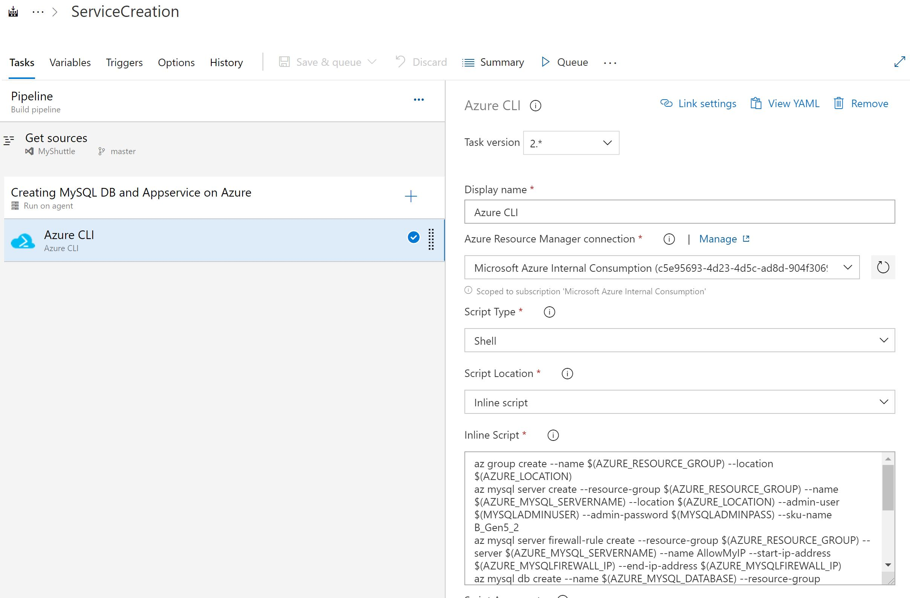
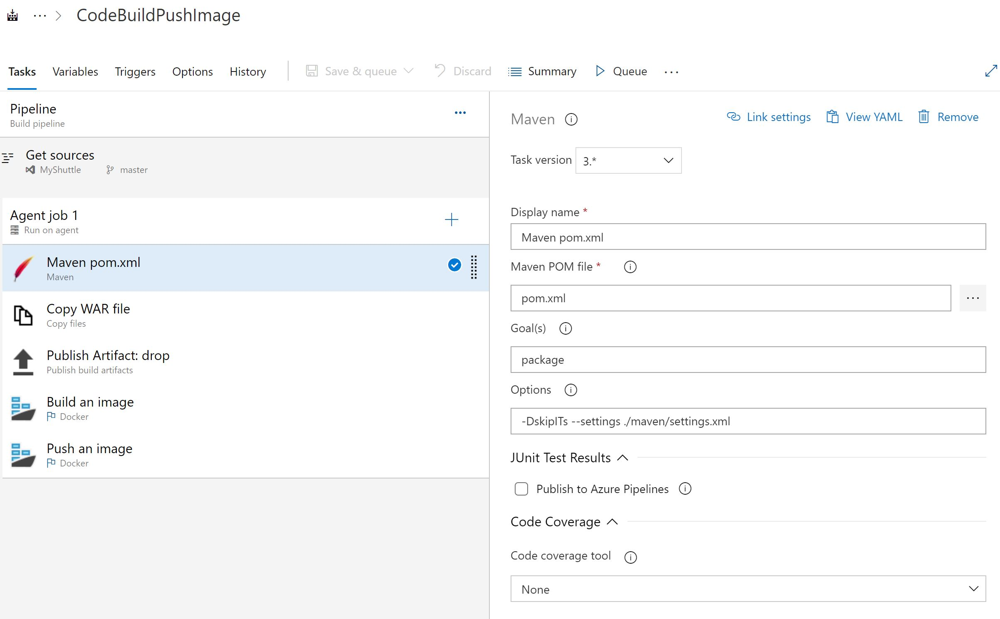
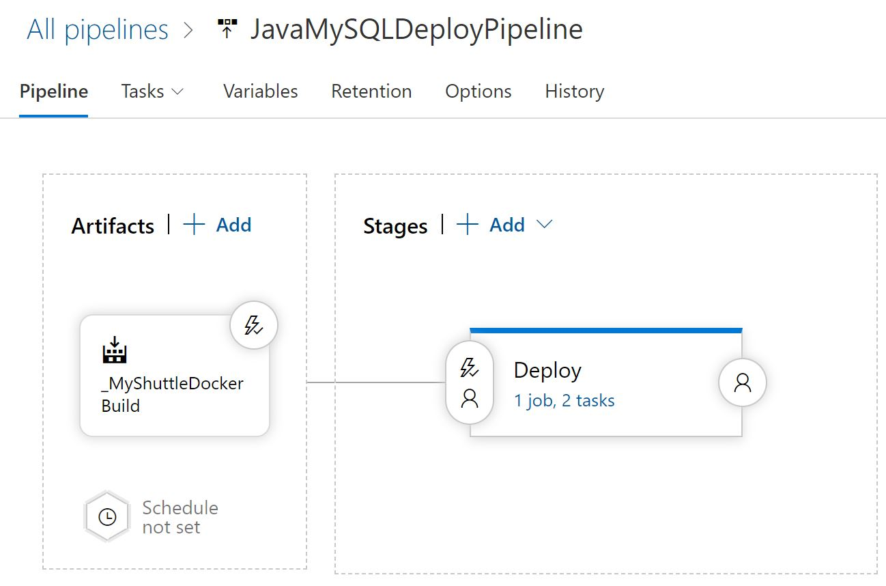
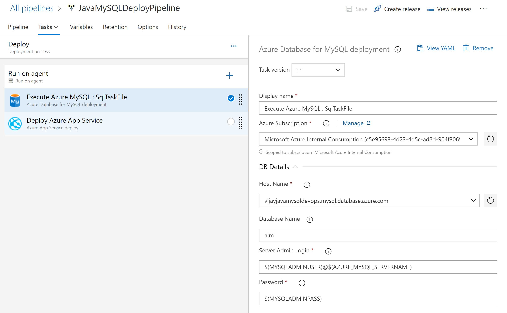
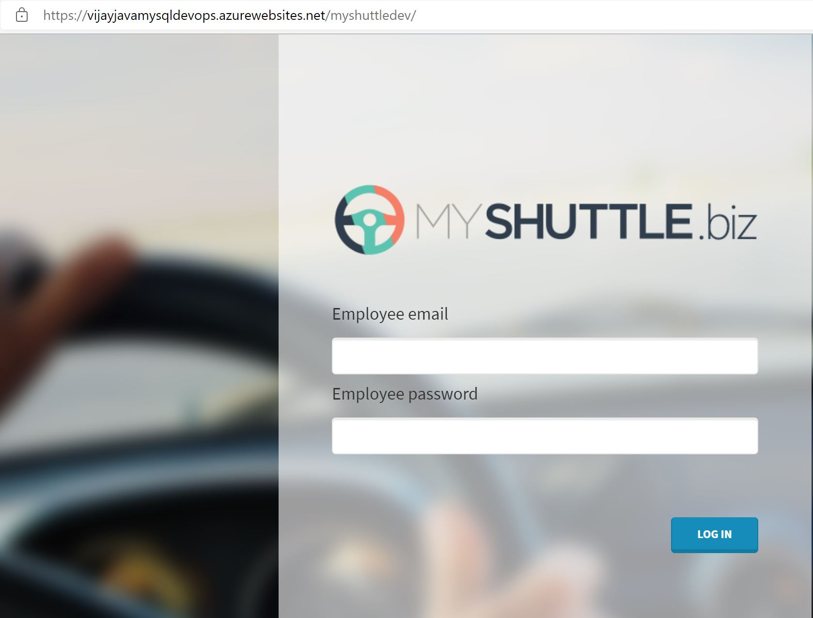
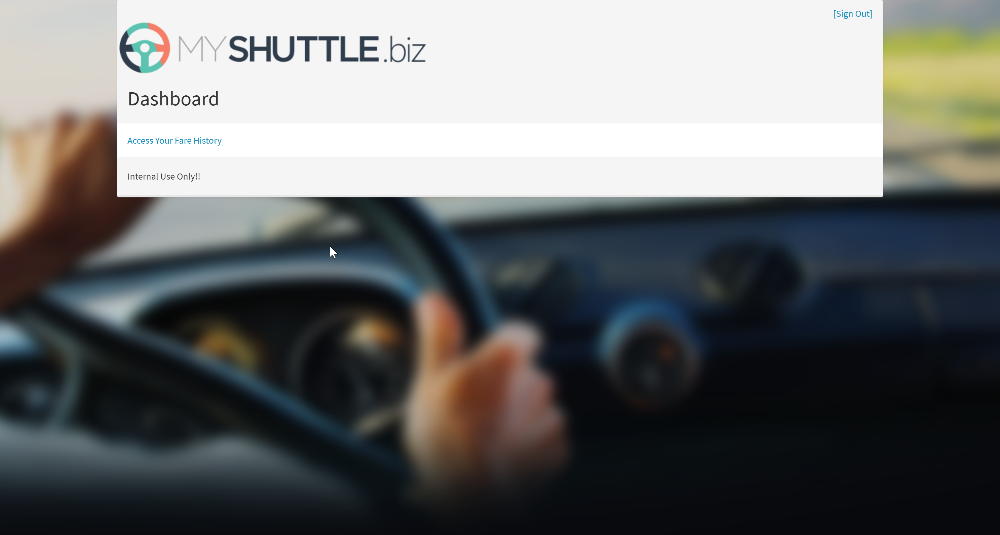

# Automating Deployment of Car Rental App using Java and MySQL

## Before you begin

1. Ensure have Azure subscription and Azure DevOps organization setup
2. Clone this Azure DevOps reposistory to have source code and create project for this Lab
3. Create Service principal which you will use to create Azure services

## Instructions for Automating Deployments using Azure Pipeline
1. We have Project code and Reposistory setup
2. create Azure Pipleline to setup Azure services at first place
3. Create Azure Pipeline to Build Java code and push image to container registry
4. Finally we will Push Container image to Azure Webapp and also upDeploy Container and update Mysql Database

### Task 1 : Create First Pipeline for Azure Webapp and MySQL Service Creation

#### Azure CLI commands for Azure CLI task

        az group create --name $(AZURE_RESOURCE_GROUP) --location $(AZURE_LOCATION)
        az mysql server create --resource-group $(AZURE_RESOURCE_GROUP) --name $(AZURE_MYSQL_SERVERNAME) --location $(AZURE_LOCATION) --admin-user $(MYSQLADMINUSER) --admin-password $(MYSQLADMINPASS) --sku-name B_Gen5_2
        az mysql server firewall-rule create --resource-group $(AZURE_RESOURCE_GROUP) --server $(AZURE_MYSQL_SERVERNAME) --name AllowMyIP --start-ip-address $(AZURE_MYSQLFIREWALL_IP) --end-ip-address $(AZURE_MYSQLFIREWALL_IP)
        az mysql db create --name $(AZURE_MYSQL_DATABASE) --resource-group $(AZURE_RESOURCE_GROUP) --server-name $(AZURE_MYSQL_SERVERNAME)
        az appservice plan create -g $(AZURE_RESOURCE_GROUP) -n $(APPSERVICE) --is-linux --sku S1 -l $(AZURE_LOCATION)
        az webapp create -g $(AZURE_RESOURCE_GROUP) --plan $(APPPLAN) --name $(APPSERVICE) -i vijaygithubregistry.azurecr.io/webmysqldevops:latest
        az webapp config container set -g $(AZURE_RESOURCE_GROUP) --name $(APPSERVICE) --docker-registry-server-url $(REGISTRY_URL) --docker-registry-server-user $(REGISTRY_USERNAME) --docker-registry-server-password $(REGISTRY_PASSWORD)
        az webapp config connection-string set -g $(AZURE_RESOURCE_GROUP) --name $(APPSERVICE) -t mysql --settings MyShuttleDb='$(MYSHUTTLEDB)'

### Task 2 : Create Second Pipeline to Build Java Code and push Image to Azure Container Registry

### Task 3: Finally Third Pipeline to Push Code to Azure Webapp and MySQL Database

 
### Finaly browse your website <WebsiteName/myshuttledev>

### Check Login to Website using below Default Logins
 
1. Select **Login** and try logging in to the site with any one of the following credentials.

   | Username | Password       |
   | -------- | -------------- |
   | barney   | barneypassword |
   | fred     | fredpassword   |

   
   

### Task 4: Update your Database as code with New credentials using MySQLUpdate Release Pipeline

# Summary
**In this Lab we implemented**

**1. Azure Services for Webapp and MySQL Database**

**2. Build and Push Container Image to Azure Container Registry**

**3. Updated MYSQL Database Login Credentials using Automation workflow**

**4. Verified login to Myyshuttle Portal**

