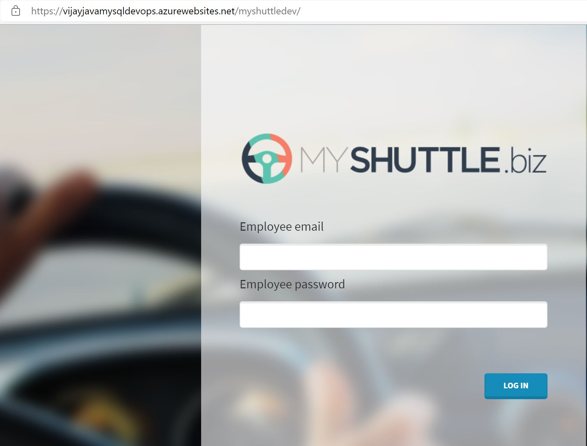

# Automating Deployment of Cosmosdb with Nodejs using Azure DevOps Pipelines

## Before you begin

1. Ensure have Azure subscription and Azure DevOps organization setup
2. Clone this Azure DevOps reposistory to have source code and create project for this Lab
3. Create Service principal which you will use to create Azure services

## Instructions for Automating Deployments using Azure Pipeline
1. We have Project code and Reposistory setup
2. Create Azure Pipeline to Build NodeJs Express code and package configuration as Artifact
3. Create Release Pipelines to Create Azure services such as Website, Cosmosdb and deploy code artifact
4. Enable Build Pipeline to start with trigger for change on code in Reposisotry
5. Enable Continous Deployment trigger for New release to be created everytime new code is built 

### Task 1 : Create Build Pipeline to Package NodeJs Express Code

Follow step by step instructions as shown in Screenshot below

### Task 2 : Create Second Pipeline to Build Java Code and push Image to Azure Container Registry

### Task 3: Finally Third Pipeline to Push Code to Azure Webapp and MySQL Database

 
### Finaly browse your website <WebsiteName/myshuttledev>

### Check Login to Website using below Default Logins
 
1. Select **Login** and try logging in to the site with any one of the following credentials.

   | Username | Password       |
   | -------- | -------------- |
   | barney   | barneypassword |
   | fred     | fredpassword   |

   
   

### Task 4: Update your Database as code with New credentials using MySQLUpdate Release Pipeline

# Summary
**In this Lab we implemented**

**1. Azure Services for Webapp and MySQL Database**

**2. Build and Push Container Image to Azure Container Registry**

**3. Updated MYSQL Database Login Credentials using Automation workflow**
