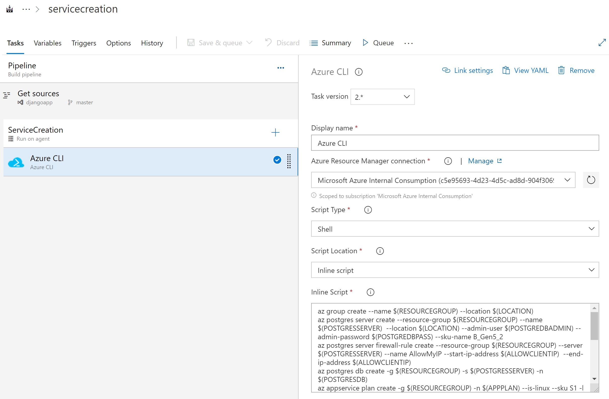

# Automating Deployment of Polls App using Django Framework and PostgresDB

## Before you begin

1. Ensure have Azure subscription and Azure DevOps organization setup
2. Create Azure DevOps project for this Lab and clone this reposistory for source code
3. Create Service principal which you will use to create Azure services

## Instructions for Automating Deployments using Azure Pipeline
1. We have Project code and Reposistory setup
2. create Azure Pipleline to setup Azure services at first place
3. Create Azure Pipeline to Build Python code and publish that to Appservice
4. Work on updating Database as code by Create Polls Questions using pSql Scripts

### Task 1 : Create First Pipeline for Azure Webapp and PostresDB Service Creation

#### Azure CLI commands for Azure CLI task

    az group create --name $(RESOURCEGROUP) --location $(LOCATION)
    az postgres server create --resource-group $(RESOURCEGROUP) --name $(POSTGRESSERVER)  --location $(LOCATION) --admin-user $(POSTGREDBADMIN) --admin-password $(POSTGREDBPASS) --sku-name B_Gen5_2
    az postgres server firewall-rule create --resource-group $(RESOURCEGROUP) --server $(POSTGRESSERVER) --name AllowMyIP --start-ip-address $(ALLOWCLIENTIP)  --end-ip-address $(ALLOWCLIENTIP)
    az postgres db create -g $(RESOURCEGROUP) -s $(POSTGRESSERVER) -n $(POSTGRESDB) 
    az appservice plan create -g $(RESOURCEGROUP) -n $(APPPLAN) --is-linux --sku S1 -l $(LOCATION)
    az webapp create -g $(RESOURCEGROUP) --plan $(APPPLAN) --name $(APPSERVICE) --runtime "PYTHON|3.8"
    az webapp config appsettings set -g $(RESOURCEGROUP) -n $(APPSERVICE) --settings DBNAME=$(POSTGRESDB)
    az webapp config appsettings set -g $(RESOURCEGROUP) -n $(APPSERVICE) --settings DBUSER=$(POSTGREDBADMIN)
    az webapp config appsettings set -g $(RESOURCEGROUP) -n $(APPSERVICE) --settings DBPASS=$(POSTGREDBPASS)
    az webapp config appsettings set -g $(RESOURCEGROUP) -n $(APPSERVICE) --settings DBHOST=$(POSTGRESSERVER)
    az webapp config appsettings set -g $(RESOURCEGROUP) -n $(APPSERVICE) --settings DBPORT=5432

### Task 2 : Create Second Pipeline to Build Java Code and push Image to Azure Container Registry

### Task 3: Finally Third Pipeline to Push Code to Azure Webapp and MySQL Database

 
### Finaly browse your website <WebsiteName/myshuttledev>

### Check Login to Website using below Default Logins
 
1. Select **Login** and try logging in to the site with any one of the following credentials.

   | Username | Password       |
   | -------- | -------------- |
   | barney   | barneypassword |
   | fred     | fredpassword   |

   
   

### Task 4: Update your Database as code with New credentials using MySQLUpdate Release Pipeline

# Summary
**In this Lab we implemented**

**1. Azure Services for Webapp and MySQL Database**

**2. Build and Push Container Image to Azure Container Registry**

**3. Updated MYSQL Database Login Credentials using Automation workflow**

**4. Verified login to Myyshuttle Portal**
