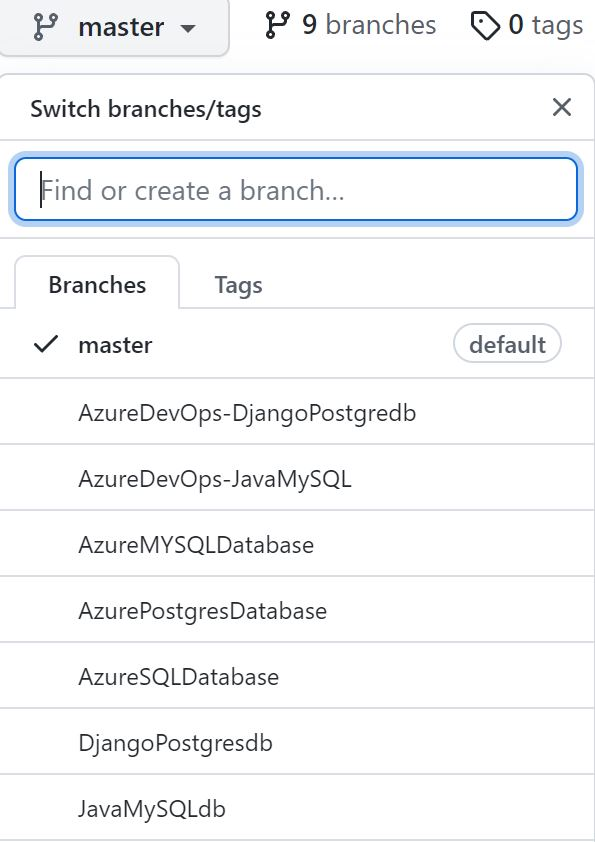

# DevOps for Databases Hands on Lab !

## Implement and update Database as Code using DevOps workflows
    - Automation Workflow  : Github Actions and AzureDevOps Pipelines
    - SQLDatabases : AzureSQLDatabase, AzureMySQL and AzurePostgreSQL 
    - NoSQLDatabases : CosmosDB with SQL and MongoDB APIs
    - Estimate time required to completed all Labs is 16 -24 hrs

## *Github Actions Labs*

### Lab 1 : Azure SQL Database and update database as code
[BranchLink : AzureSQLDatabase](https://github.com/jethanivijay/DevOpsforDatabasesHandsonLab/tree/AzureSQLDatabase)

### Lab 2 : Azure MYSQL Database and update database as code
[BranchLink : AzureMYSQL](https://github.com/jethanivijay/DevOpsforDatabasesHandsonLab/tree/AzureMYSQLDatabase)

### Lab 3 : Azure Postgres Database and update database as code
[BranchLink : AzurePostgresDatabase](https://github.com/jethanivijay/DevOpsforDatabasesHandsonLab/tree/AzurePostgresDatabase)

### Lab 4  : Create Online Polls using Django App and PostgreSQL DB
[BranchLink : Django App and PostgreSQL DB](https://github.com/jethanivijay/DevOpsforDatabasesHandsonLab/tree/DjangoPostgresdb)

### Lab 5 : Create Webapp for Car Rental Vendor using Java and MySQL
[BranchLink : Java and MySQL DB ](https://github.com/jethanivijay/DevOpsforDatabasesHandsonLab/tree/JavaMySQLdb)

### Lab 6 : Track Website Hits with Express and Cosmosdb(MongoAPI)
[BranchLink : NodeJsExpress and CosmosDB ](https://github.com/jethanivijay/DevOpsforDatabasesHandsonLab/tree/expresscosmosdb)

### Lab 7 : Create ToDoList with Status check using Java and CosmosDB(SQLAPI)
[BranchLink : Java and CosmosDB ](https://github.com/jethanivijay/DevOpsforDatabasesHandsonLab/tree/javacosmosdb)

## *Azure DevOps Pipeline Labs*

### Lab 8 :Create Polls using Django App and PostgresQLDB
[BranchLink : AzureDevOps-PollsApp](https://github.com/jethanivijay/DevOpsforDatabasesHandsonLab/tree/AzureDevOps-DjangoPostgredb)

### Lab 9 :Create Car Rental Wesbite using Java and MySQLDB
[BranchLink : AzureDevOps-CarRentalApp](https://github.com/jethanivijay/DevOpsforDatabasesHandsonLab/tree/AzureDevOps-JavaMySQL)

### Lab 10 : Track Website Hits with Express and Cosmosdb(MongoAPI)
[BranchLink : AzureDevops-ExpressCosmosDb ](https://github.com/jethanivijay/DevOpsforDatabasesHandsonLab/tree/AzureDevOps-expresscosmosdb)

### Lab 11 : Create ToDoList with Status check using Java and CosmosDB(SQLAPI)
[BranchLink : AzureDevOps-javacosmosdb ](https://github.com/jethanivijay/DevOpsforDatabasesHandsonLab/tree/AzureDevOps-javacosmosdb)

##  Instructions to Get Started on this Labs

**Prequisite(Mandate)**
### 1. Github Personal Account

### 2. Azure Subscription

## Step by Step Guides to help you get started ! 

[**Reference 1 : Github Actions Syntax**](https://docs.github.com/en/free-pro-team@latest/actions/reference/workflow-syntax-for-github-actions)

[**Reference 2 : Connecting to Azure using Service principal**](https://docs.microsoft.com/en-us/cli/azure/create-an-azure-service-principal-azure-cli)

Service Principal is used to Authenticate and perform task on Azure subscription.
Here is command line reference to create one service principal for you

- **Giving Service Principal access to Complete Subscription**

    az ad sp create-for-rbac --name "myApp" --role contributor --scopes /subscriptions/{subscription-id} --sdk-auth

- **If you want scope of service principal retricted to resource Group follow command below**

    az ad sp create-for-rbac --name "myApp" --role contributor --scopes /subscriptions/{subscription-id}/resourceGroups/{resource-group} --sdk-auth

    Output of this will be similar 

      {

        "clientId": "<GUID>",

        "clientSecret": "<GUID>",

        "subscriptionId": "<GUID>",

        "tenantId": "<GUID>",

        (...)

      }

Copy Complete Parenthesis and create Github Secret , This will be our First Github Secret !

## Code Branches for this Hands on Lab

