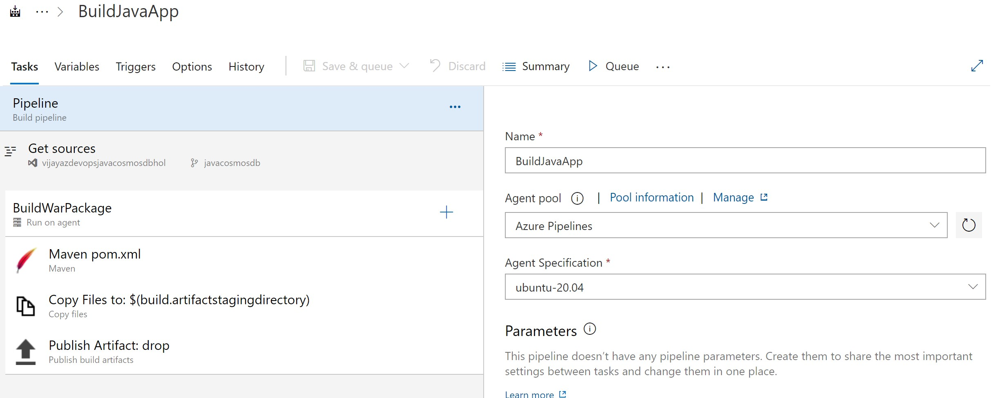
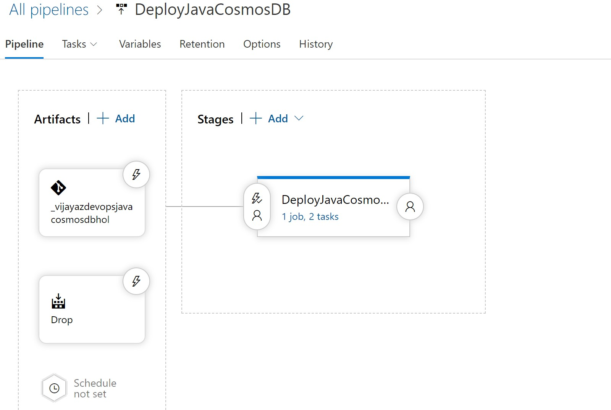
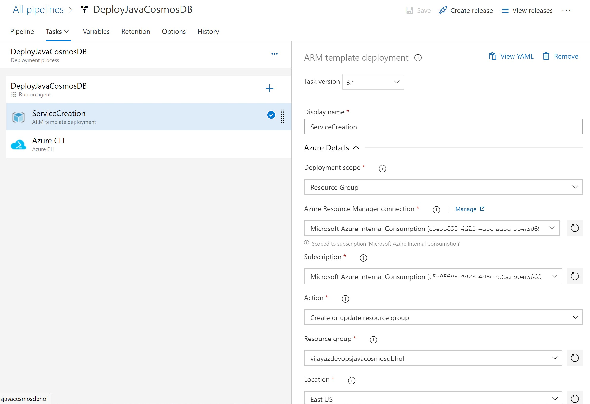

# Automating Deployment of Cosmosdb with Java using Azure DevOps Pipelines

## Before you begin

1. Ensure have Azure subscription and Azure DevOps organization setup
2. Clone Hands on Lab reposistory to have source code and create New project for this Lab
3. Create/Use existing Service principal which have minimum contributor rights to create Azure services

## Instructions for Automating Deployments using Azure Pipeline
1. We have Project code and Reposistory setup
2. Create Azure Pipeline to Build WAR package and package configuration saved as Artifact
3. Create Release Pipelines to Create Azure services such as Website, Cosmosdb and deploy WAR package
4. Enable Contionus Integration for Build Pipeline to start with trigger for change on code in Reposisotry
5. Enable Continous Deployment trigger for New release to be created everytime new code is built 

### Steps for Build Pipeline to Package WAR file from Java Code

Follow step by step instructions as shown in Screenshot below

### Step for Release pipeline to Create Azure Services and Deploy code

Create New Release pipeline and add Artifact drop from Build Pipeline

**NOTE : If your password contains ! special character ensure you enclose your password in single quotes while setting password variable, otherwise curl will fail to deploy WAR package with Unauthorized access denied message**

### Finaly browse your website <WebsiteName>

 
# Summary
**In this Lab using Azure Pipeline as Automation workflow we implemented**

**1. Azure Services for Webapp and Cosmosdb Database**

**2. Build Create WAR Package and saved that as Artifact**

**3. Deployed War package using Automation workflow**

